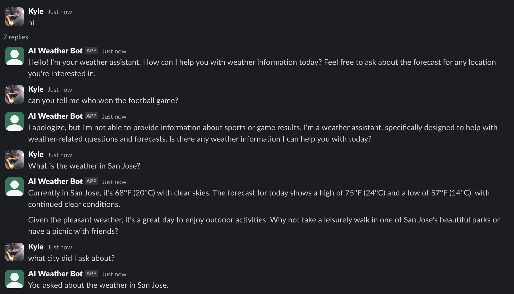

# AWS Bedrock Weather Agent

This project implements an AWS Bedrock Agent that can retrieve weather information using a free weather API.

## Prerequisites

- AWS Account with Bedrock access. You need to manually enable model access for Claude 3.5 Sonnet. This should happen fairly quickly to get access and you are charged only when you use it. Not all models are "aws-agent-optimized". Make sure you have credentials already set up for AWS.
- Terraform installed. This is used to create the agents, ECR repo, lambda, and IAM roles your basic agent will need
- Docker installed
- Set your SLACK_BOT_TOKEN and SLACK_APP_TOKEN environment variables for your slack bot

## Setup

1. Create the ECR repo and build/publish the weather app container to it

```bash
cd infra
terraform init
terraform apply -target=aws_ecr_repository.weather_lambda
./build.sh
```

2. Set up rest of AWS resources

```bash
cd infra
terraform apply
```
## Usage

3. Run the client application:
   ```bash
   pip3 install -r requirements.txt
   python app.py
   ```

You can then chat with your agent in Slack

## Architecture

- AWS Bedrock Agent: Handles natural language processing and intent recognition
- Lambda Weather Tool Function: Executes the actual weather API calls. The agent calls this with the required parameter of location
- OpenWeather API: Provides the weather data
- Python app.py: Interacts with the Bedrock Agent and Slack

## Cleanup

To remove all resources:
```bash
cd infra
terraform destroy
``` 

## Workflow

```
                      External Services
                   +---------------------+
                   |                     |
                   |   Open-Meteo API    |
                   |  Weather & Geocoding|
                   |                     |
                   +-----------^---------+
                               |
                               |
      AWS Cloud                |
   +----------------------------------------------------------+
   |                                                          |
   |              Creates & Configures                        |
   |  +---------------+      +-------------------+            |
   |  |  Terraform    |----->|  IAM Roles        |            |
   |  |  (main.tf)    |      |  & Permissions    |            |
   |  |               |----->|                   |            |
   |  +-------+-------+      +-------------------+            |
   |          |                                               |
   |          |       +----------------+    +--------------+  |
   |          +------>| Bedrock Agent  |    |              |  |
   |                  | (Claude 3.5)   |--->| Lambda       |--+
   |                  |                |<---| Function     |
   |                  +--------^-------+    | (weather)    |
   |                           |            |              |
   +---------------------------|------------+--------------+
                               |
                       +-------v--------+
                       |                |
                       |   Python App   |<---- Reads Terraform
                       |   (app.py)     |      Output for IDs
                       |                |
                       +-------^--------+
                               |
                               |
                       +-------v--------+
                       |                |
                       |  Slack Bot     |
                       |  Integration   |
                       |                |
                       +-------^--------+
                               |
                               |
                       +-------v--------+
                       |                |
                       |      User      |
                       |                |
                       +----------------+
```

## Example


