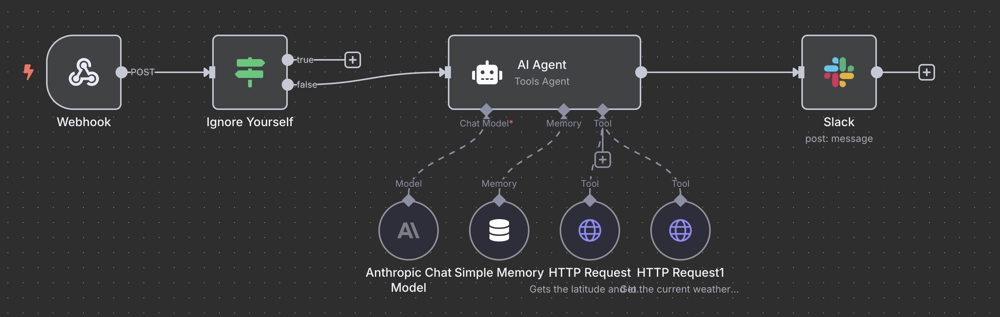
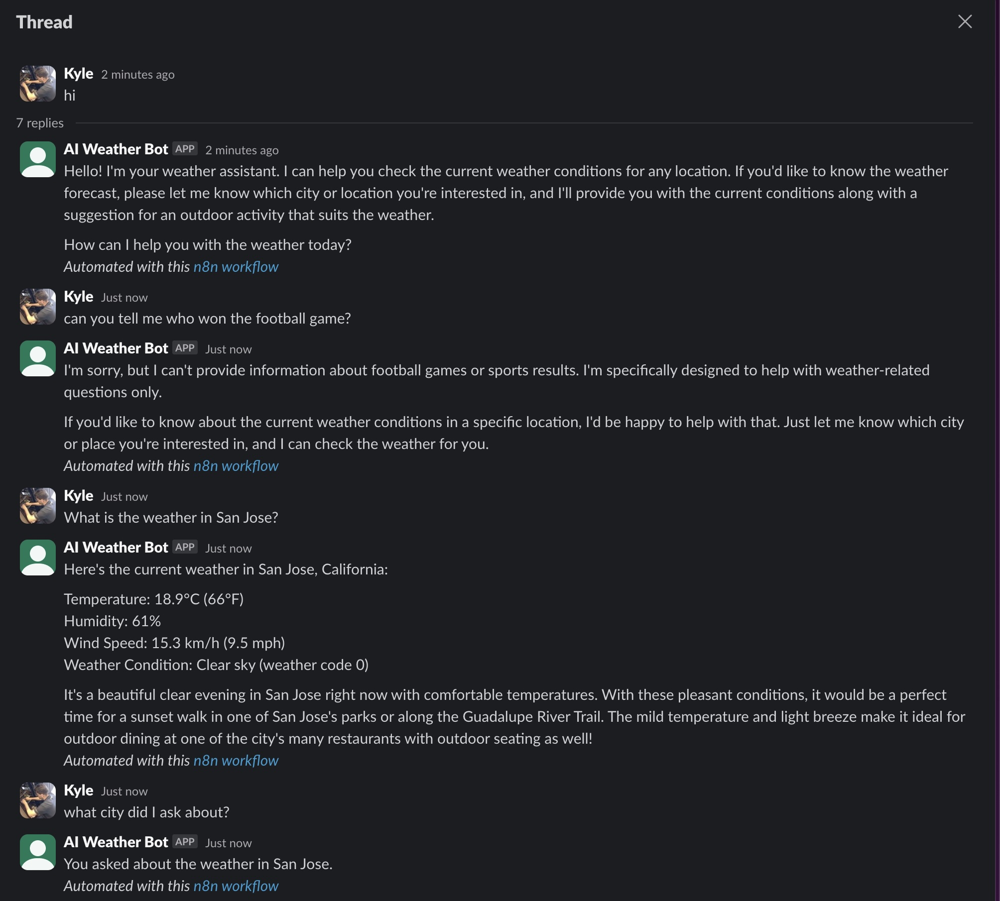

## Pre-reqs

For this to work, you will need:
- Docker installed
- Slack SLACK_BOT_TOKEN and SLACK_APP_TOKEN in your environment variables

## Setup

build and run the docker container

```bash
./start-n8n.sh 
```

start the slack integration 

```bash
./app.py
```

- go to http://localhost:8080 in your browser
- sign up (doesn't really matter what you put here)
- Click "get started" and skip the marketing stuff
- Click on "Weather Agent Workflow"
- double click on "Anthropic AI Model" and update the key to your Anthropic API Key
- double click on Slack and update the key to the value of your SLACK_BOT_TOKEN
- "save" the workflow

As long as your slackbot is in the channel, the bot should respond now!

Workflow:



Example:

